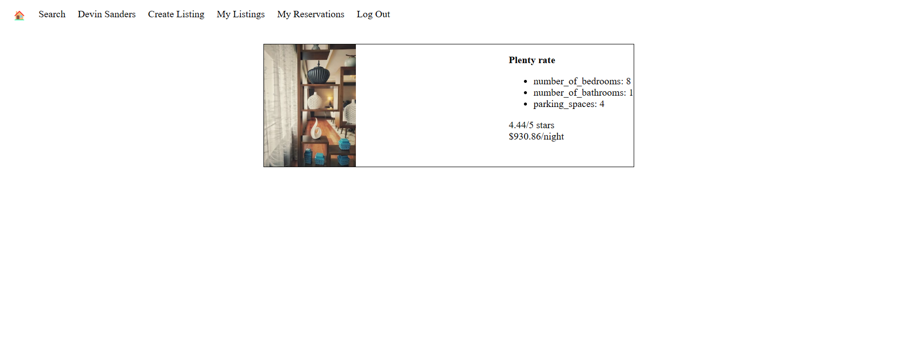
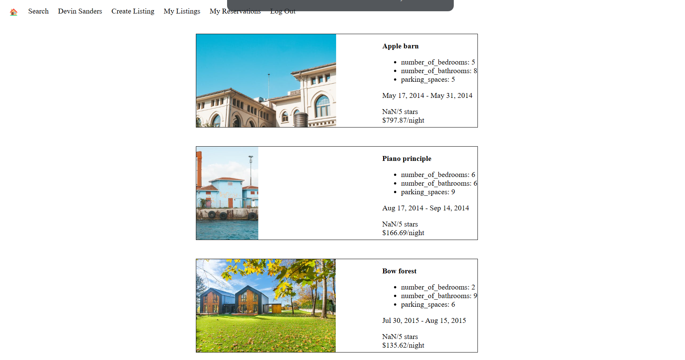
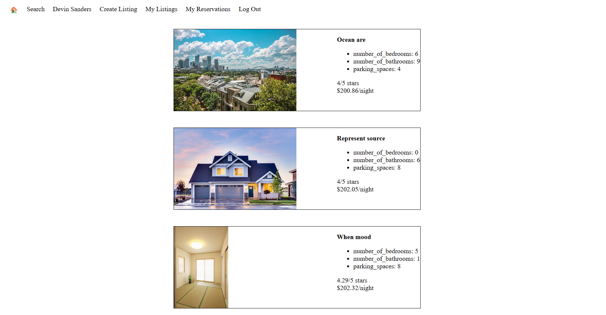

# LightBnB Project
A simple multi-page Airbnb clone that uses a server-side Javascript to display the information from queries to web pages via SQL queries.

## Getting Started

1. Clone your repository onto your local device.
2. Install any dependencies with `npm i`
3. You may need to have `npx` installed first. If so run `npm install -g npx`
4. In the terminal from LightBnB directory, complete the following:
  a. `startpostgres`
  b. `psql`
  c. Enter password
  d. `CREATE DATABASE lightbnb`
  e. `\c lightbnb`
  f. Enter password
  g. `\i migrations/01_schema.sql`
  h. `\i seeds/02_seeds.sql`
5. To run the app, from the terminal in the LightBnB_WebApp directory type `npm run local`
6. View in the browser on localhost:3000

## Dependencies

- bcrypt
- cookie-session
- express
- nodemon
- pg

## Screenshots

### View your listings when logged in

### View your reservations when logged in

### Search listings with city, minimum cost, maximum cost, and minimum rating filters

